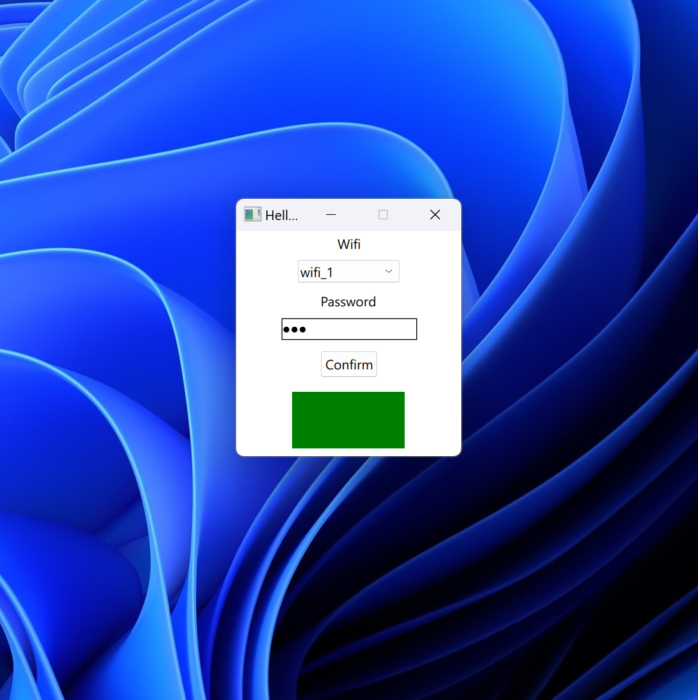

# Wifi setup application

## Goal

Develop a Client-Server verification/connection application ( e.g. a WiFi Setup application).
The end-users of such app can possibly use devices with varying screen configurations.

## Description

The goal of this exercise is the development of a simple Qt application that simulates the
behavior of a Client-Server verification/connection system.
A simple scalable UI should be developed for the inputs on the client side. There is no need for
a UI development for the server-side, only a C++ model that will take the Server settings from a
JSON file and conduct the checks against the client-side.

The deliverable should be a stand-alone application with one screen that will represent the
Client side. The user should be able to give inputs and attempt connection with the server-side
and the UI should be updated based on the failure/success. The server settings will be given in
a separate JSON file that will live in the same directory of the main app.
All coding will be done in Qt5.

## Results

The following image is a screenshot of the client GUI.

